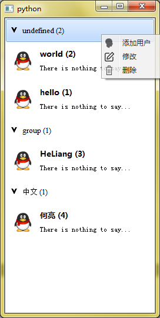
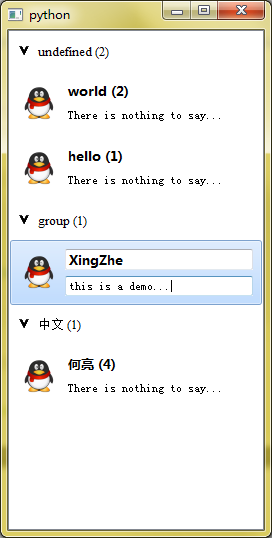

[TOC]


# 需求
- 基本的用户分组列表，类似QQ好友列表界面。主要支持如下操作：
- 用户和组的增删改查操作。其中组名称不能重复，用户ID不能重复。
- 界面右键单击的操作，右键选择用户可以执行修改、删除操作；右键选择组可以增加用户、修改组、删除组；右键选择空白地区可以弹出增加用户、组的操作。
- 界面的拖放操作，可以将用户拖放到某个组实现移动操作。
- 所涉及的列表控件可以添加到布局文件中，作为界面的嵌入使用（只需要继承到QWidget即可）。


# 实现效果截图
 


# 实现过程
## 1. 定义全局的默认参数
```
import os,sys
from PyQt4.QtCore import *
from PyQt4.QtGui import *

DEFAULT_GROUP = u'undefined'
DEFAULT_HEAD = u'icons/qq.png'
DEFAULT_USER = u'new user'
DEFAULT_NOTE = u'There is nothing to say...'
```

## 2. LabelHead(QLabel)
<span id="LabelHead"></span>

主要是为了展示用户头像，但是在编辑用户头像的时候单击他要可以选择头像文件。因此增加了一个只读属性，当只读时单击不生效，可读时单击弹出图片选择框。


##3. LineEdit(QLineEdit)
<span id="LineEdit"></span>

主要是为了显示用户和组名称，因此在编辑用户和组名称时需要其为可以输入，其它时候为不可输入，因此继承到QLineEdit。通过其setStyleSheet设置只读和可读时的状态实现。QLineEdit默认有右键菜单，因此为了让其在只读时不影响列表右键菜单操作，重写其contextMenuEvent，可写时调用父类的即可。对于mousePressEvent以及mouseMoveEvent、mouseDoubleClickEvent（双击选中全部内容可以用于ctrl+c复制）同理。


## 4. 用户信息展示
用户信息展示的控件 **UserItem（界面操作）** 和用户列表控件 **UserListItem （列表逻辑操作）** 是两个相互关联的类。主要是互相调用实现界面和逻辑操作的关联。

### UserItem 界面操作
<span id="UserItem"></span>

1. 主要就是用户信息（name,id,note,head）的编辑、保存以及获取，创建时其内部就维护一个 UserListItem 的实例 _listWidgetItem ，以UserListItem中实现逻辑操作函数的调用。
> 注：group属性被当作逻辑管理需要的参数放到了UserListItem类中实现。
2. 用户信息（name,id,note,head）分别对应他们的显示控件，就是前面 [LabelHead(QLabel)](#LabelHead) 和 [LineEdit(QLineEdit)](#LineEdit)，根据情况设置对应控件的字体等参数。
3. 用户信息（name,id,note,head）都保存在本类中，因此有getName和getNameInput函数的操作区别，也就是说将 **信息保存在本类中的一个优势就是可以选择接收或者放弃输入的内容，让其可以灵活控制子控件的输入和显示**。
4. 为了实现姓名后面显示ID的操作，在设置姓名控件内容的时候需要采用`_nameWidget.setText('%s (%d)' %(self._name,self._id))`的方法，但是需要注意的是这样做在editInfo编辑用户名称时需要将控件的文字设置为`_nameWidget.setText(self._name)`。
5. 信息的输入editInfo和锁定lockInfo操作需要是相互的。**允许输入后并不代表输入就会接收，因此复写keyPressEvent在回车键时确认输入，因为确认输入涉及到逻辑操作问题，调用其内的 _listWidgetItem 实现confirmInput**。
6. 右键菜单就是增加修改和删除操作，虽然绑定的槽函数目标不同，但是其本质上都是调用_listWidgetItem实现其操作的逻辑处理。
7. 为了让用户的显示控件可以拖动，复写mouseMoveEvent事件，设置拖拽内容为本控件。

### UserListItem 逻辑操作
<span id="UserListItem"></span>

1. 创建时就在内部维护一个 UserItem 控件实例_widget并锁定其信息，需要让其尺寸绑定`self.setSizeHint(self._widget.sizeHint())`。另外需要维护父 ListWidget 控件以便调用父类的更复杂逻辑操作函数。
>由于id是唯一的，因此本类也维护了用户ID。
2. 其大部分操作都是调用其内的_widget控件实现，并根据需要设置本类的其它补充操作。比如修改用户名称是也修改本 QListWidgetItem 的文字（透明的`self.setTextColor(QColor(0x00,0x00,0x00,0x00))`并不影响显示）以便兼容原始的QListWidgetItem某些操作。
3. confirmInput操作和giveUpInput就是确认输入和放弃输入的操作，另外补充一个delSelfFromList调用父类removeUserItem的接口，实际上是因为UserItem没有绑定父类因此只能通过在其内部`delUser.triggered.connect(self._listWidgetItem.delSelfFromList)`实现转接。


## 5. 组信息展示

其逻辑和用户信息展示几乎相同，不同的地方是组可以展开和关闭，展开和关闭需要让其组下的用户显示和隐藏。其实现方式就是在GroupItem(QWidget,QObject)下定义一个expended信号，当单击组的展开图标时就发射信号到用户Item的setHidden，即`self._widget.expended.connect(uit.setHidden)`。
> 1.需要注意用户移动必须删除在新建到新组下，否则原来的组expended依然绑定到该用户it会收到影响。
> 2.将expended定义到GroupItem的原因是因为QListWidgetItem不能和QObject一起使用。无法定义静态信号。

### GroupItem
<span id="GroupItem"></span>

大部分实现思路和 [UserItem](#UserItem) 相似，不同之处主要是：

1. 内部的展开控件使用QPushButton以便绑定其clicked到组的toggleGroup，在其内设置展开和关闭的`setStyleSheet("border-image: url(icons/arrow_d.png);")`，并发射展开关闭信号expended。
2. 其右键增加了添加用户操作，主要就是调用 GroupListItem 的addNewUser逻辑操作。
3. **UserItem允许拖，GroupItem允许放，两者结合实现用户的拖放修改组功能**。主要支持拖放需要如下几步：
- 被拖动的对象UserItem需要复写mouseMoveEvent判断鼠标按下左右键来通过drag = QDrag(self)发射拖动的内容drag.start(Qt.MoveAction)；
- 允许放入的对象GroupItem需要设置为self.setAcceptDrops(True)；
- 允许放入的对象GroupItem需要在dragEnterEvent中设置e.accept()，之后才能进入到dragMoveEvent和dropEvent事件实现操作。
> 这里GroupItem在dragEnterEvent时通过`self._listWidgetItem.setSelected()`设置自己为选择状态；在dropEvent时通过e.source().getListItem()获取放入的uit并调用`self._listWidgetItem.moveUserIn(srcUit)`实现用户的移动操作。


### GroupListItem
<span id="GroupListItem"></span>

组列表控件负责逻辑工作的实现，保存组内的用户uit，因此维护一个用户列表usrList用于获取用户uit。其它和[UserListItem](#UserListItem)几乎相似。主要不同的地方在于：

1. addUser 操作中将`self._widget.expended.connect(uit.setHidden)`绑定组展开信号和用户显示操作。


## 6. GroupUserList
<span id="GroupUserList"></span>

主要的分组用户列表显示控件。包含增加组、增加用户等功能的实现。其使用方法参考[UsingGuide](#UsingGuide)。主要实现思路如下：

1. 在用户选择的Item切换时调用chooseItemChanged函数实现输入的放弃。在里面实现对previous对于的控件显示Item进行锁定lockInfo操作。控件内容的lockInfo的主要操作就是让其输入框都变为只读。
> 对于自定义的LineEdit用于编辑信息的类，需要复写其mousePressEvent以便在父控件QListWidget中鼠标选择各个Item时单击在被只读的输入框上无法生效的问题。其实现方法是判断是只读状态则忽略事件，如果不是只读状态则调用父类的mousePressEvent处理事件。
2. 输入的确定在各个控件中按回车键确认，参考个控件的操作逻辑。本类也设置setAcceptDrops主要是为了拖动时比较好看些，但是没有实现具体的操作， **后期可以在dragMoveEvent中移动用户控件**。
3. 添加组时会判断组是否已存在，添加用户时判断是否存在其组，不存在会自动创建。*这里没有执行用户 ID重复的检查，需要自己判决。*用户的删除和组的删除都是根据给定的Item实现的，主要是几乎是界面操作，这样比较简单。
4. **moveUser 实现原理是先增加用户到新的组，在删除该用户**。
5. 复写了父类的insertItem和takeItem以便可以直接插入和删除自定义的Item。


# 注意事项

1. 由于假设组名称唯一，因此所有删除组等操作都是在组名称基础上修改，而不是在组Item上修改。而用户名称不唯一，因此删除用户设置了可以在Item上修改，也可以基于用户ID修改（ID被假设唯一，但是这样的修改非常麻烦，还得导出找ID）。
2. 查看源码发现 QListWidgetItem 并不是继承至 QtGui 的控件， 因此不能直接在里面布局， 因此选择了扩展一个 自定义 QWidget 和一个 QListWidgetItem ，但是两者之间需要保证信息同步操作。
3. 为了让输入的字符都规范，在对几乎所有的输入文字都将其转换为unicode了。
4. 为了让ListWidget可以执行sort增加了好多复杂的工作在 ListWidgetItem 和自定义Item之间进行text同步（主要实现方法就是把所有关键字都保存在自定义Widget中，复写 ListWidgetItem 的获取都从自定义Widget中获取）。其实也可以复写自定义 ListWidgetItem 的大小判断操作符--参考官方参考文档。
5. 拖放操作的实现主要是在允许拖放的QWidget控件（ GroupUserList 和 GroupItem ）上设置setAcceptDrops(True)，然后实现dragEnterEvent中e.accept并进行适当的处理，即可在dropEvent 和 dragMoveEvent 中实现对应的操作了。具体的操作就是：在UserItem中复写mouseMoveEvent左键按下时将本uit传递到drag参数中；在GroupUserList中值允许三个事件；在GroupItem的dragEnterEvent设置当前GroupListItem选中、dropEvent中将该用户uit添加到本组中。


# undo

1. 增加查找和搜索用户功能增加。>>可以在使用的时候添加一个透明列表专门用于查询。
2. _动画效果的添加，最好是扩展一个动画类，用的时候根据性能和功能均衡选择一种。_


# GroupUserList 使用方法
<span id="UsingGuide"></span>

1. GroupUserList 控件继承到 QListWidget ，可以当作 QWidget 添加到界面布局，也可以被作为主界面操作。
2. 用户和组的 **增加** ： addUser 和 addGroup ， 如果增加用户指定了ID则最好保证整个项目中一直都指定ID，而且ID必须是 int 数据。
3. 用户和组的 **删除** 建议在右键菜单中执行，主要是 removeUserItem 和 removeGroupItem 两个函数，需要输入所在的Item。也可以自己编写一个逻辑来找到用户和组所在的item，具体可以（常见的方法--组根据组名称删除， 用户根据用户ID删除举例）：
> a.组item的查找可以直接在 groupDict 中根据组名称返回gitem。
b.用户item需要首先根据a调出各组gitem，然后根据gitem中的usrList判断是否存在相同ID的uitem，如果存在则删除之即可。

4. 用户和组的 **修改** ：只需要按照3的思路找到用户所在的item，然后调用item的 editInfo 方法即可，编辑完成后输入回车就会保存所编辑的内容，选择其它Item则会放弃修改。其它修改方式自行编写， **建议先删除原来的uit然后重新adduser指定详细信息。**
5. 用户和组的 **查找** ：参考3的思路，两步操作。

项目地址：https://github.com/HeLiangHIT/pyqtChat
博客地址：http://blog.csdn.net/u010151698


# 参考网址

1. http://doc.qt.io/qt-4.8/qlineedit.html > qlineedit 的修改
2. http://doc.qt.io/qt-4.8/qdropevent.html 和 http://doc.qt.io/qt-4.8/qdrag.html > dropEvent 源的获取
3. http://doc.qt.io/qt-4.8/classes.html > QT 所有类列表
4. [QListWidget Class Reference](ref\QListWidget Class Reference.pdf) >查看详细的列表类函数（已高亮重点）。
5. [QListWidgetItem Class Reference](ref\QListWidgetItem Class Reference.pdf) >查看详细的列表Item类函数。


